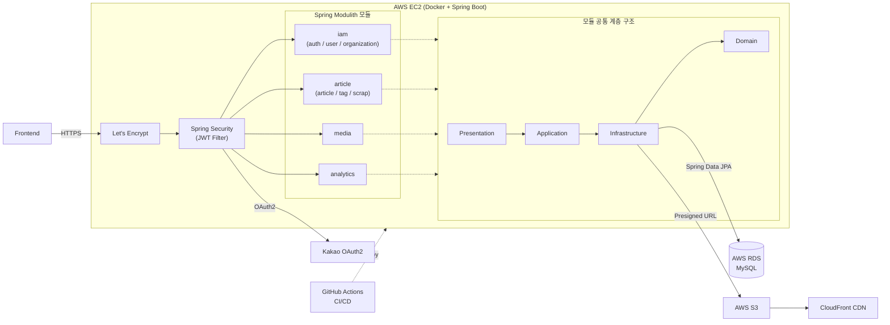

# Univent Backend API (Kotlin / Spring Boot)

대학교 행사 정보를 한 곳에 통합해 제공하는 웹서비스 **Univent**의 현재 운영 백엔드 서버입니다.
SNS, 대학생 커뮤니티, 학교 공식 웹사이트 등 여러 채널에 흩어져 있는 행사 정보를 하나의 플랫폼에 모으고, 태그 기반 필터링과 스크랩 기능으로 개인화된 행사 탐색 경험을 제공합니다.

- Repository: [univent-dev/api](https://github.com/univent-dev/api)
- 이전 [NestJS 서버](https://github.com/univent-dev/api-nest)에서 장기 운영 안정성을 위해 전환되었습니다.

가입자 100명 이상, 일평균 트래픽 500~1,000건 규모로 운영 중입니다.

---

## 목차

1. [서비스 개요](#서비스-개요)
2. [기술 스택](#기술-스택)
3. [아키텍처](#아키텍처)
4. [주요 기능](#주요-기능)
5. [실행 방법](#실행-방법)

---

## 서비스 개요

| 항목 | 내용 |
| --- | --- |
| 한 줄 소개 | 대학교 행사 정보 제공 웹서비스 |
| 진행 기간 | 2025.03 ~ 2026.03 |
| 팀 구성 | PM 1명, 디자이너 1명, 프론트엔드 2명, 백엔드 2명 (총 6명) |
| 서비스 지표 | 가입자 100+, 일평균 트래픽 500~1,000 |

서비스 기획 전, **에브리타임 커뮤니티에 투표**를 게시해 **실제 수요를 먼저 검증**한 뒤 개발을 시작했습니다. 학교 행사 정보가 여러 채널에 분산되어 탐색이 어렵다는 문제의식에서 출발해, 정보를 한 곳에 모으고 태그 기반으로 개인화된 탐색을 제공하는 방향으로 서비스를 구체화했습니다.

---

## 기술 스택

| 구분 | 스택 |
| --- | --- |
| Language | Kotlin |
| Framework | Spring Boot, Spring Modulith (모듈러 모놀리스) |
| Security | Spring Security, OAuth2 Client(카카오 로그인), JWT (jjwt) |
| Database | MySQL, Spring Data JPA / JDBC |
| Infra | AWS EC2, Docker, AWS S3 (Presigned URL 업로드) |
| CI/CD | GitHub Actions |
| 분석 | Amplitude |
| Build | Gradle (Kotlin DSL) |

---

## 아키텍처

### 시스템 아키텍처

기존 NestJS 서버와 동일하게 EC2 위 Docker 컨테이너로 배포되며, HTTPS는 Let's Encrypt로 처리하고 GitHub Actions로 CI/CD가 자동화되어 있습니다. 서버 내부는 **Spring Modulith 기반 모듈러 모놀리스**로, 도메인 모듈이 각각 독립적으로 **Domain-Application-Infrastructure-Presentation** 4계층을 가집니다.



### 모듈 구성

Spring Modulith 기반으로 도메인별 모듈이 분리되어 있으며, 각 모듈은 아래 4계층 구조를 공통으로 따릅니다.

```
com.univent.api
├── iam            # 인증/인가, 사용자, 단체(organization)
│   ├── auth
│   └── user / organization
├── article        # 행사 게시글, 태그, 스크랩
│   ├── article
│   ├── tag
│   └── scrap
├── media          # 이미지 업로드 (Presigned URL)
├── analytics      # Amplitude 이벤트 트래킹
├── common         # 공통 도메인/예외/유틸리티
└── config         # Security, 인프라 설정
```

| 계층 | 역할 | 핵심 규칙 |
| --- | --- | --- |
| **Domain** | 핵심 비즈니스 로직 | `private constructor` + `companion object`의 `create()`/`of()` 팩토리로 생성 제한, `val`/`private set`으로 캡슐화 |
| **Application** | 유스케이스 처리 | UseCase 인터페이스 1개 = 액션 1개(단일 책임), Command/Result로 요청·응답 표현 |
| **Infrastructure** | 외부 시스템 연동 | JPA Entity 내부에 `fromDomain()`/`toDomain()` 배치, 별도 Mapper 클래스 미생성 |
| **Presentation** | API 엔드포인트 | DTO는 `sealed class` 하위 `Req`/`Res`로 구조화, `@PreAuthorize` 기반 인가, `CustomExceptionCode`로 예외 응답 표준화 |

### 인증/인가

- 카카오 OAuth2 로그인 + JWT(Access/Refresh) 발급
- 쿠키 기반 토큰 전달 (`accessToken`, `orgAccessToken`, `adminAccessToken`)
- `USER` / `ORGANIZATION` / `ADMIN` 역할(Role) 기반 인가 (`@PreAuthorize`)

### 이미지 업로드

클라이언트가 발급받은 Presigned URL로 S3에 직접 업로드하고, 업로드 성공을 확인한 뒤에만 백엔드가 메타데이터를 저장하는 구조입니다. (URL 발급 → S3 업로드 → 메타데이터 저장 API 분리)

---

## 주요 기능

- 대학교 행사 정보 게시글(Article) 등록/조회, 태그 기반 필터링
- 행사 스크랩(Scrap) 기능
- 카카오 소셜 로그인 및 회원/단체(Organization) 계정 관리
- Presigned URL 기반 다중 이미지 업로드 (게시물당 최대 11장, 개당 최대 5MB)
- Amplitude 기반 사용자 행동 분석

---

## 실행 방법

### 사전 요구사항

- JDK 25
- MySQL

### 실행

```bash
./gradlew bootRun
```

### 테스트

```bash
./gradlew test
```
